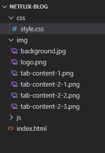

Netflix-Clone-Coding
=============

## 넷플릭스 클론 코딩
넷플릭스의 홈페이지(메인화면)을 클론 코딩하는 프로젝트입니다.
웹 프로그래밍 관련 유튜버 **Traversy Media**의 **[Build a Netflix Landing Page Clone with HTML, CSS & JS](https://youtu.be/P7t13SGytRk)** 강의를 참고하여 진행하는 프로젝트입니다.    
* * * 

📑 클론 코딩 진행 순서 📑     
     
     
**① Showcase area**

**② Tabs**

**③ Footer**

**④ JavaScript**      

  

✅ 넷플릭스 클론 코딩을 위한 준비 ✅    

1. 이미지 : 연습에 필요한 이미지는 아래의 링크에서 다운받으면 된다.      
     
     

- Showcase Backgrounnd-  https://i.ibb.co/vXqDmnh/background.jpg

- Netflix Logo-                 https://i.ibb.co/r5krrdz/logo.png

- Tab Content-1-              https://i.ibb.co/J2xDJV7/tab-content-1.png

- Tab Content-2-1            https://i.ibb.co/DpdN7Gn/tab-content-2-1.png

- Tab Content-2-2            https://i.ibb.co/R3r1SPX/tab-content-2-2.png

- Tab Content-2-3            https://i.ibb.co/gDhnwWn/tab-content-2-3.png

2. 폴더 및 파일     

       
3. 최종 결과

